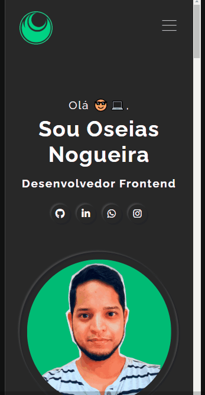

<h1 align="center">Portfólio Oficial 💼</h1>

Este é meu portfólio de apresentação onde falo um pouco sobre mim, mostro minhas habilidades e projetos construídos. 
Para maiores informações entre em contato. Será um prazer te responder. 💻😎

 
 <h2>🕹️ Tecnologias Utilizadas</h2>
    <ul align="center">
        
        
    </ul>

 

<h2 align="center">Como Utilizar 🤔</h2>
 
O projeto apresenta as opções sobre mim, habilidade e projetos.
 

<i>Gif - funcionalidades do sistem</i>

<h2 align="center">Página Responsiva 📐</h2>

O projeto apresenta responsividade para os dispositivos: 

<ul>
    <li>Desktop 🖥️</li>
    <li>Tablet 💻</li>
    <li>Smartphone 📱</li>
</ul> 

<i>Gif - Responsividade da página.</i>

<h2 align="center">🔗 Link da página</h2>
<a href="https://oseiasweb.github.io/Portfolio-Oficial/" target="_blank">Portfólio Oficial</a>  

<h2 align="center">🏆 Status Projeto</h2>

 

